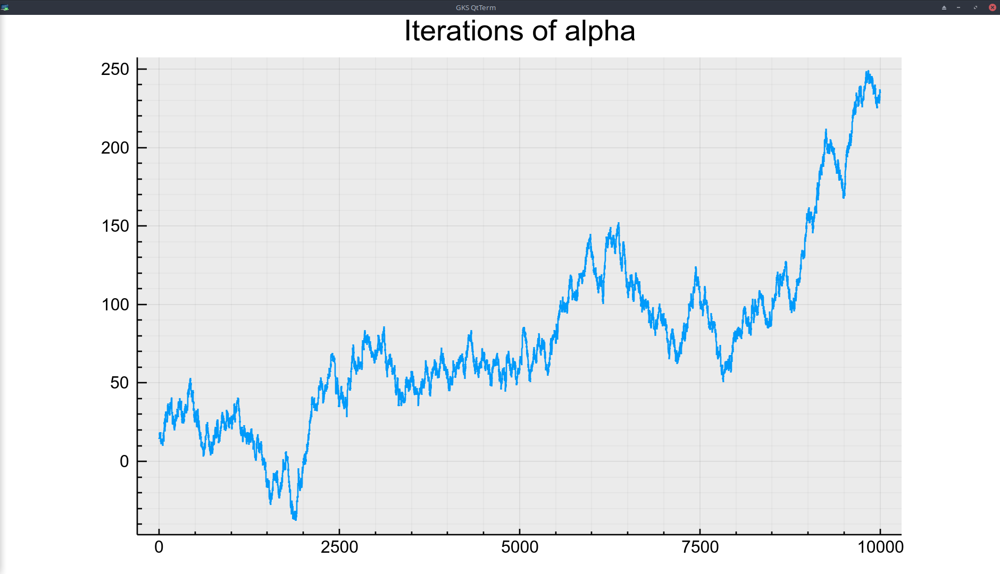
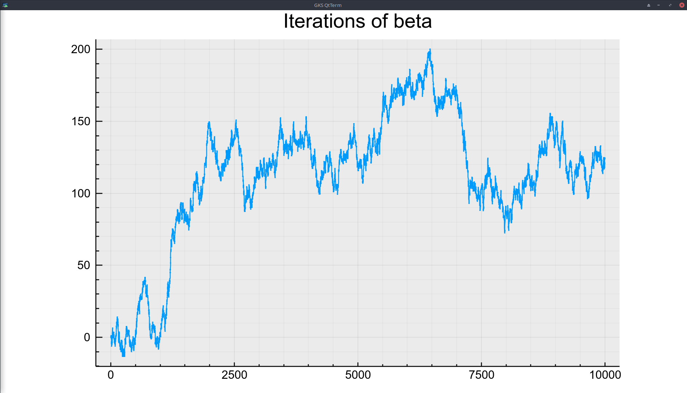
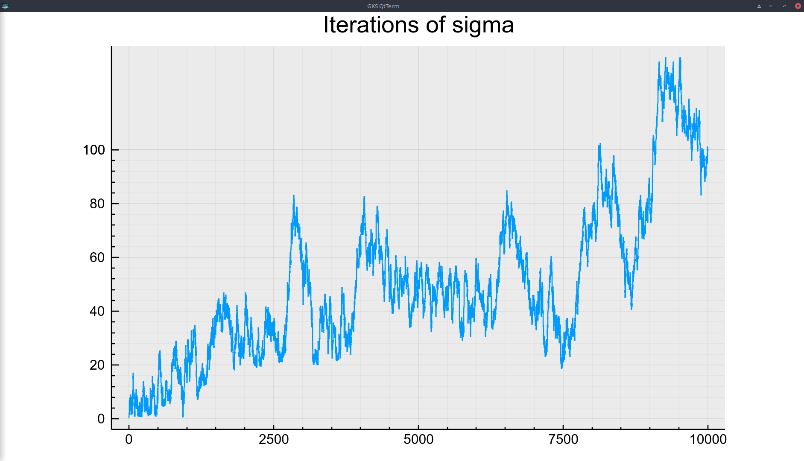
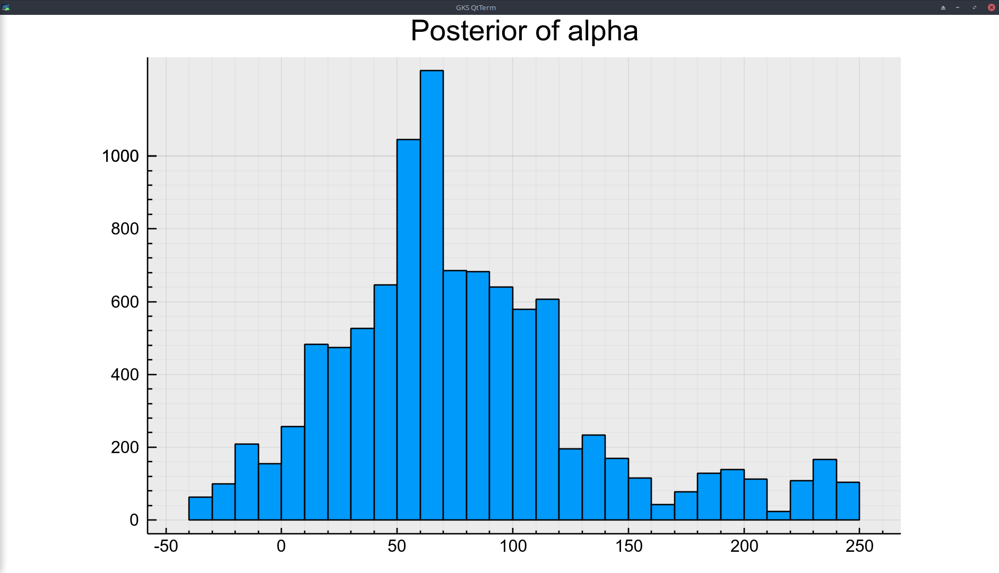
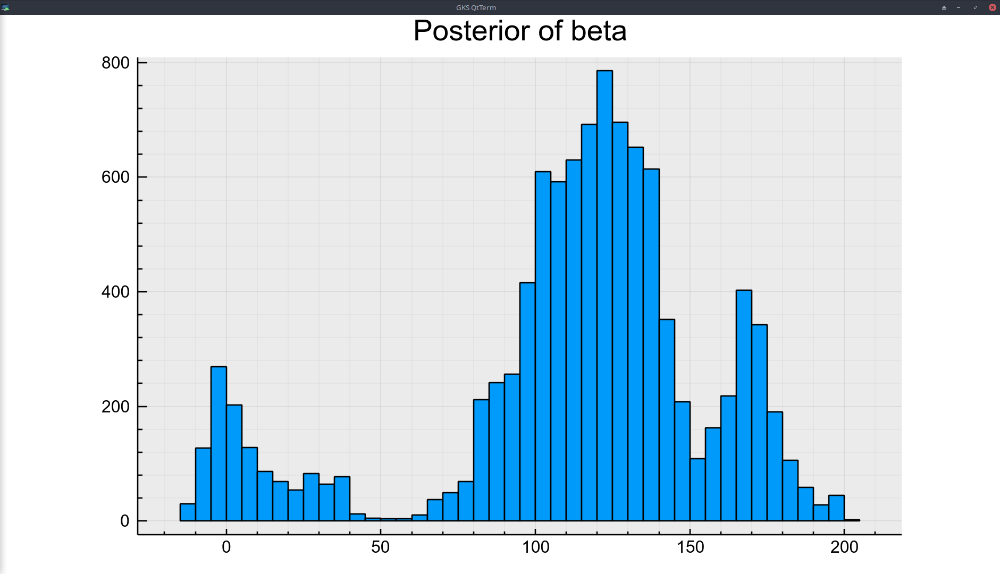
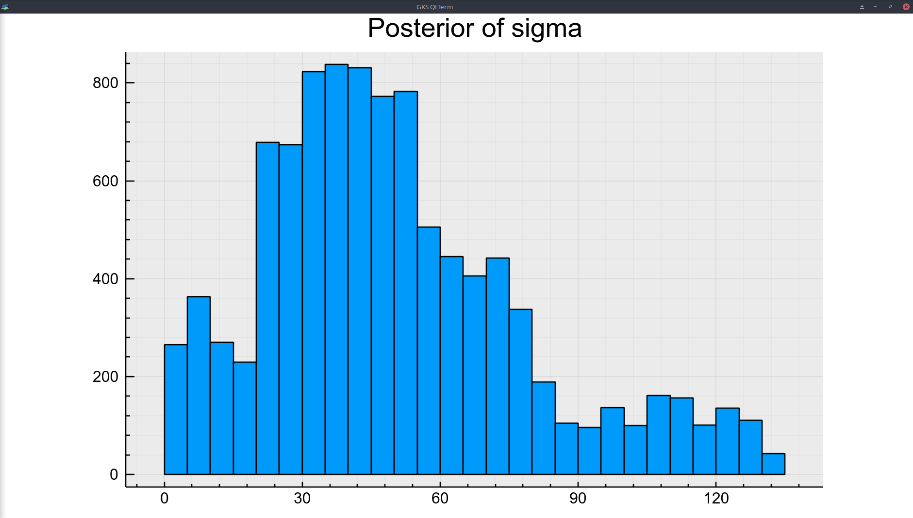
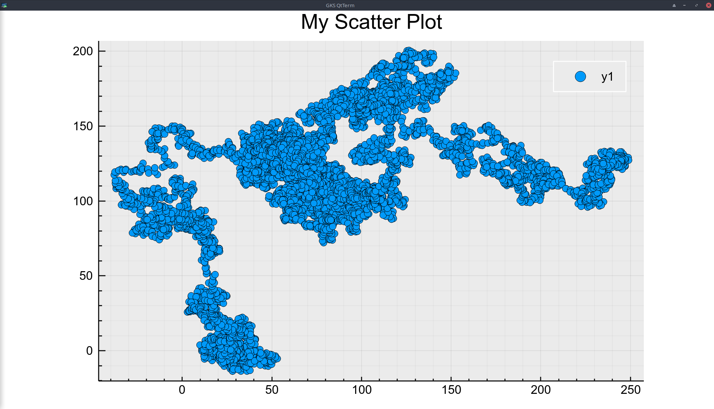
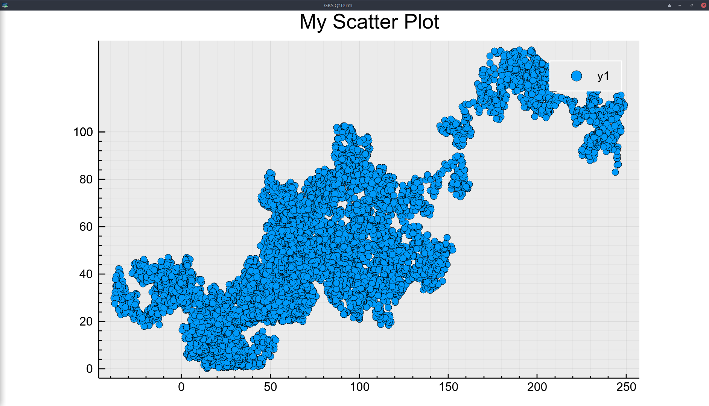

# Alpha Iterations

# Beta Iterations

# Sigma Iterations

 # Alpha posterior

# Beta posterior

# Sigma posterior

# Alpha - beta correlation

# Alpha - sigma correlation

# beta - sigma correlation
